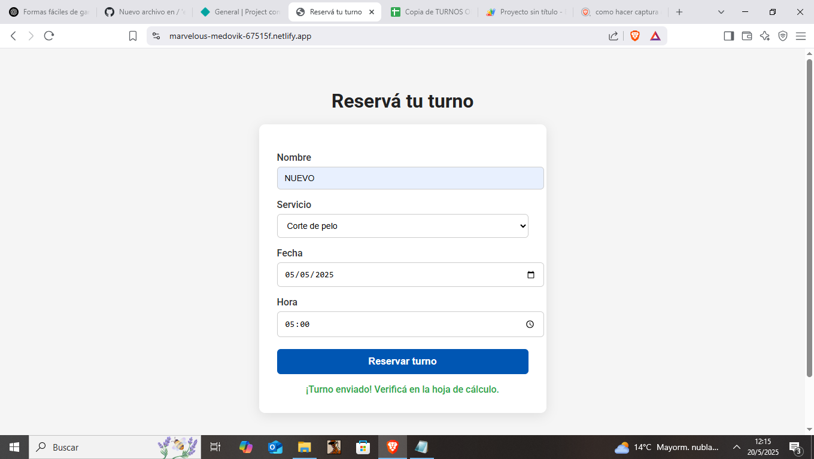

# 🗓️ Sistema de Reservas con Google Sheets

Este proyecto es un sistema de reservas simple y funcional, pensado para pequeños negocios que necesitan recibir turnos online sin conocimientos técnicos. El formulario se conecta directamente con una hoja de cálculo de Google Sheets donde se registran automáticamente los turnos reservados.

---

## 🚀 Características principales

- ✅ Formulario web moderno y responsivo
- ✅ Sin bases de datos complicadas
- ✅ Se integra directamente con Google Sheets
- ✅ Se puede personalizar fácilmente (servicios, estilos, horarios)
- ✅ Desplegado en Netlify o desde archivo local

---

## 📷 Captura de pantalla

.png)

---

## 🛠️ Tecnologías usadas

- HTML5 + CSS3
- JavaScript
- Google Apps Script (backend sin servidor)
- Google Sheets (como base de datos)
- Netlify (para desplegar el formulario online)

---

## 💡 Cómo funciona

1. El cliente llena el formulario con nombre, servicio, fecha y hora.
2. Al hacer clic en "Reservar turno", los datos se envían directamente a un Google Apps Script.
3. El Script guarda automáticamente el turno en una hoja de cálculo de Google Sheets.
4. El cliente recibe una confirmación en pantalla.

---

## 🔧 Personalización

Se puede personalizar para cada cliente:
- ✏️ Servicios ofrecidos
- 🎨 Estilos visuales (colores, logo, tipografía)
- 🕒 Rango de horarios
- 🌐 Dominio propio o página en Netlify

> 🔐 Cada cliente recibe su propia hoja de cálculo privada con el control total sobre sus datos.

---

## 🧪 Demo

Podés probar una versión de ejemplo online:
🔗 [Ver demo en Netlify](https://sistemadereservasdemo.netlify.app/)  

---

## 📁 Estructura del proyecto

---

## 🤝 Autor

Desarrollado por Gonzalo Maturana]  
📧 Contacto: gonzamaturana2020@gmail.com  
🌍 Portafolio: https://app.netlify.com/teams/gonzamaturana2020/projects

---

## 📝 Licencia

Este proyecto está licenciado bajo MIT License.
