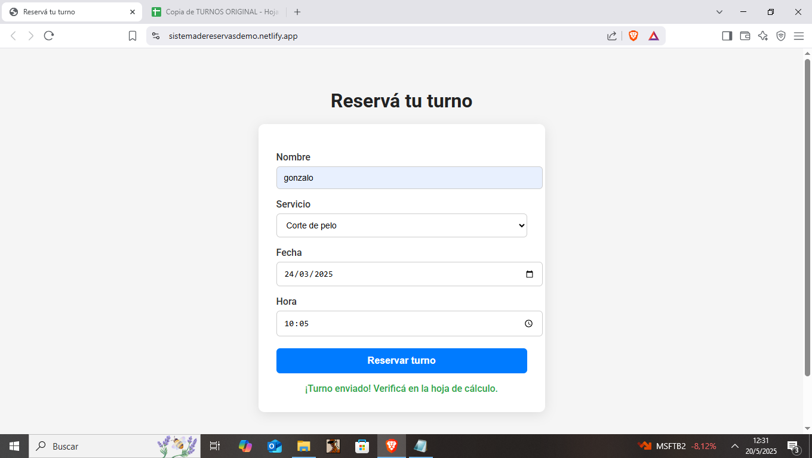
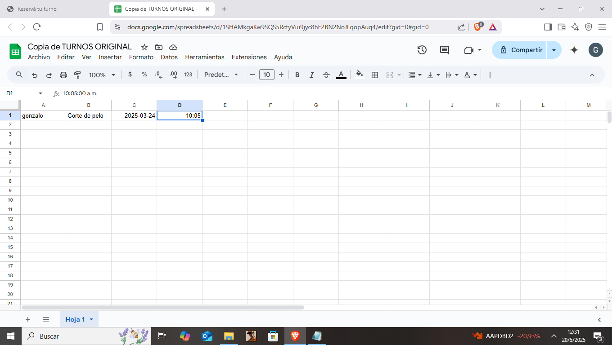

# Sistema de Reservas Online

Este proyecto es un sistema de reservas simple y funcional que utiliza Google Sheets como base de datos y se puede implementar rápidamente con HTML y Apps Script. Ideal para pequeñas empresas como peluquerías, consultorios o estudios que necesiten tomar turnos online.

---

## 📷 Capturas de pantalla

### Formulario principal

### Turno registrado en Google Sheets

---

## 🚀 Tecnologías utilizadas

- HTML + CSS (formulario y diseño)
- Google Apps Script (backend sin servidor)
- Google Sheets (base de datos de turnos)
- Netlify (hosting gratuito)

---

## ⚙️ Cómo funciona

1. El usuario completa el formulario con su nombre, servicio, fecha y hora.
2. Al hacer clic en "Reservar turno", los datos se envían a un script de Google Apps.
3. El script guarda automáticamente la información en una hoja de cálculo.
4. El cliente ve un mensaje de confirmación en pantalla.

---

## 📁 Estructura del proyecto

---

## 🛠️ ¿Cómo se configura para otro cliente?

1. Hacer una copia de la hoja de cálculo original.
2. Abrir el editor de Apps Script, pegar el código y hacer una nueva implementación como app web.
3. Reemplazar el URL del script en el archivo `index.html`.
4. Subir el proyecto a Netlify u otro hosting.
5. Transferir la propiedad de la hoja de cálculo al cliente.
6. Entregarle el enlace de su página de reservas.

---

## ✨ Características adicionales

- Diseño simple y profesional (con fuente Roboto).
- Código claro y bien estructurado para facilitar su análisis o personalización.
- No requiere backend ni base de datos externa.
- Fácil de adaptar y escalar.

---

## ✅ Ideal para

- Freelancers que quieren vender soluciones listas para usar.
- Emprendedores que no saben programar.
- Proyectos educativos o demostraciones.

---

## 📩 Contacto

Si querés consultar sobre personalizaciones o implementación de este sistema, podés escribirme.

